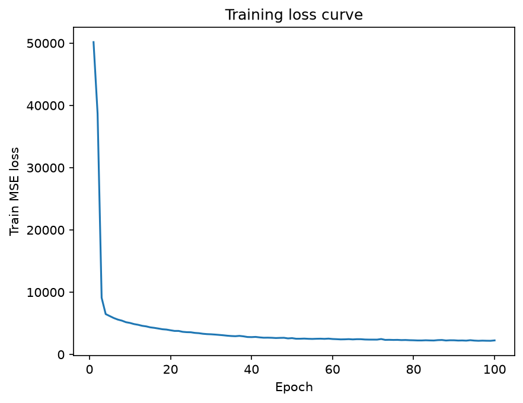
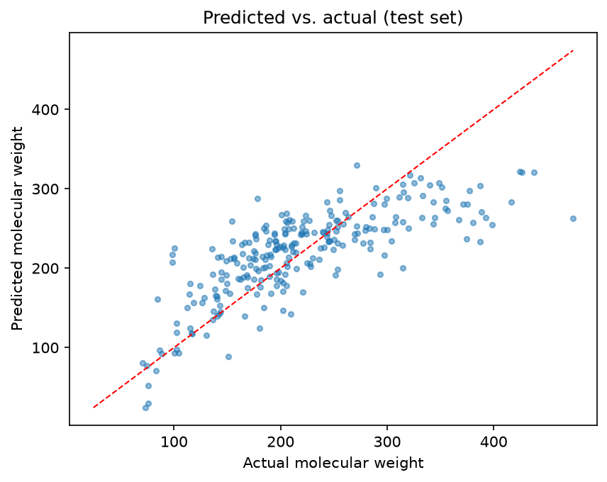
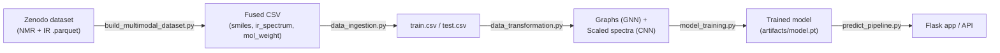
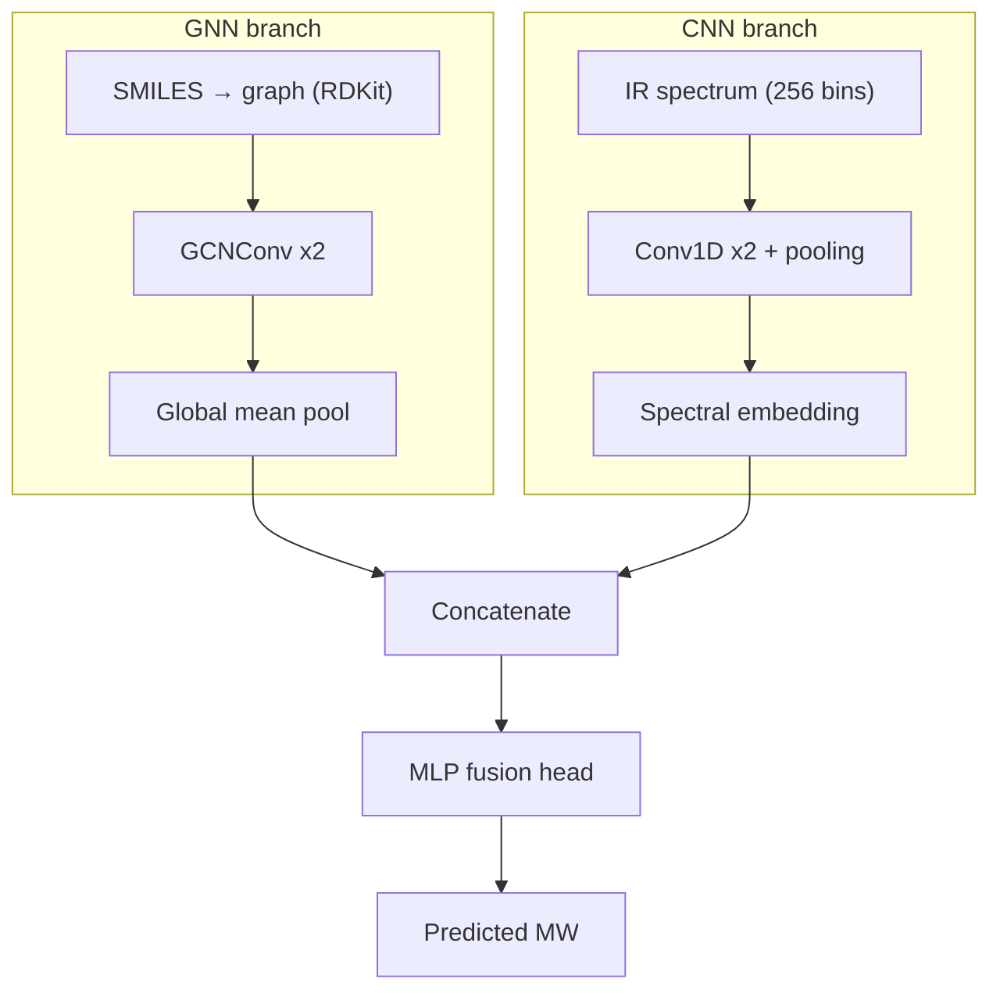

# 🧪 Multimodal Spectral Property Predictor

**Predicting molecular weight by fusing molecular graphs (GNN) and IR spectra (1D-CNN).**

[](https://www.python.org/)
[](https://pytorch.org/)
[](https://pytorch-geometric.readthedocs.io/)
[](https://www.rdkit.org/)
[](https://flask.palletsprojects.com/)
[](https://www.docker.com/)
[](LICENSE)

> 🎬 **Demo**
> _Add a short GIF of the `/predictdata` form in action here (record with [ScreenToGif](https://www.screentogif.com/) or [Kap](https://getkap.co/), save as `docs/demo.gif`)_
> ``

---

## Why this project?

Traditional molecular property prediction relies on expensive laboratory experiments. This project explores **multimodal deep learning** by fusing molecular graph representations with infrared spectra to predict molecular weight — a step toward faster, cheaper, data-driven alternatives to wet-lab characterization.

## ✨ Highlights

- 🔀 **CNN + GNN multimodal architecture** — fuses spectral and structural information
- 🧬 Predicts molecular weight from **IR spectra + molecular graphs**
- 🌐 **Flask web interface** + JSON **REST API**
- 🐳 **Dockerized** for reproducible deployment
- ⚙️ **Automated training pipeline** (ingestion → transformation → training)
- ✅ CI via **GitHub Actions** (lint + test on every push)
- 📦 Fully reproducible, end-to-end workflow

---

## Results

Test-set performance (see [`artifacts/model_config.json`](artifacts/model_config.json)):

| Metric | Value |
|---|---|
| **MAE**  | 39.66 |
| **RMSE** | 51.77 |
| **R²**   | 0.578 |

> These numbers reflect a small (~1,000 row) dataset and a compact baseline architecture — see [Future work](#future-work) for planned improvements. Retrain with `train_pipeline.py` and these values will update automatically.




---

## Example prediction

**Input**

| Field | Value |
|---|---|
| SMILES | `CCO` (ethanol) |
| IR spectrum | `0.13, 0.22, 0.09, ...` (256 bins) |

**Output**

```
Predicted Molecular Weight: 46.03 g/mol
```

```bash
curl -X POST http://localhost:5000/predictdata \
  -d "smiles=CCO" \
  -d "ir_spectrum=0.13,0.22,0.09,...,0.03"
```

---

## Architecture

**End-to-end pipeline**



**Fusion network**



---

## Tech stack

| | | |
|---|---|---|
| Python | PyTorch | PyTorch Geometric |
| RDKit | Flask | Docker |
| Pandas | NumPy | Scikit-learn |
| GitHub Actions | Gunicorn | pytest |

---

## Project structure

```
├── app.py / wsgi.py         Flask app + production entrypoint
├── Dockerfile                Container build
├── notebook/                 Dataset construction (Zenodo → CSV)
├── src/
│   ├── components/            Ingestion, transformation, training
│   └── pipeline/               train_pipeline.py, predict_pipeline.py
├── templates/                 Web UI (index.html, home.html)
├── tests/                      pytest suite
└── artifacts/                 Trained model, scaler, metrics, plots (gitignored)
```

📄 Full file-by-file breakdown: see [`docs/PROJECT_STRUCTURE.md`](docs/PROJECT_STRUCTURE.md) *(add this file if you want the long-form version)*.

---

## Quickstart

```bash
git clone <your-repo-url>
cd multimodal-spectral-property-predictor
python -m venv venv && venv\Scripts\activate      # Windows
pip install --upgrade pip
pip install torch --index-url https://download.pytorch.org/whl/cpu
pip install torch-geometric
pip install -r requirements.txt
```

**Build the dataset**
```bash
python notebook/build_multimodal_dataset.py --demo --n 500   # fast synthetic stand-in
# or, for the real ~8GB Zenodo download:
python notebook/build_multimodal_dataset.py
```

**Train**
```bash
python src/pipeline/train_pipeline.py
```

**Run locally**
```bash
python app.py                     # dev server → http://localhost:5000
# or, production-style:
gunicorn -w 2 -b 0.0.0.0:5000 --timeout 120 wsgi:application
```

---

## API

### `POST /predictdata`
Form-encoded (`application/x-www-form-urlencoded`):

| Field | Type | Description |
|---|---|---|
| `smiles` | string | Valid SMILES string, e.g. `CCO` |
| `ir_spectrum` | string | Comma-separated floats (256 bins) |

| Status | Meaning |
|---|---|
| `400` | Invalid SMILES or spectrum format |
| `503` | Model not trained yet |
| `500` | Unexpected error |

### `GET /health`
```json
{"status": "ok", "model_loaded": true}
```

---

## Dataset

**IR-NMR Multimodal Computational Spectra Dataset for 177K Patent-Extracted Organic Molecules** (Zipoli, Alberts, Laino; IBM Research) — [Zenodo record 16417648](https://doi.org/10.5281/zenodo.16417648), CDLA-Permissive-2.0.

Only molecules present in **both** the NMR (1,255) and IR (177,461) files are kept, yielding a curated fused set of **~1,000 rows** — by design, not a bug.

---

## Deployment

Builds as a self-contained Docker image (Python 3.11-slim + RDKit/PyG system deps).

```bash
docker build -t spectral-predictor .
docker run -p 5000:5000 spectral-predictor
```

Deployed on [Render](https://render.com) via Dockerfile auto-detection; verify at `https://<your-app>.onrender.com/health`.

---

## Future work

- [ ] Attention-based GNNs / Graph Transformers
- [ ] Multi-property prediction (beyond molecular weight)
- [ ] Uncertainty estimation
- [ ] Explainable AI (Grad-CAM, Integrated Gradients)
- [ ] Kubernetes deployment
- [ ] ONNX / TensorRT inference optimization

---

## Troubleshooting

| Symptom | Cause | Fix |
|---|---|---|
| `OSError: [WinError 1114]` loading `torch\lib\c10.dll` | Missing VC++ Redistributable or torch/PyG version mismatch | Install [VC++ Redistributable](https://aka.ms/vs/17/release/vc_redist.x64.exe); reinstall matched torch + PyG versions |
| Same DLL error, only on `torch_geometric` import | PyG built against a different torch ABI | Pin both to versions PyG's docs list as supported together |
| `pip install -r requirements.txt` fails building numpy | No prebuilt wheel for pinned numpy version | Relax the numpy pin to allow 2.x |
| `pyarrow` build fails / conflicts with numpy 2.x | Old `pyarrow<16.0` requires `numpy<2` | Bump to `pyarrow>=16.0` |
| `ImportError: pyarrow is required for parquet support` | pyarrow removed assuming it was unused | Needed by `build_multimodal_dataset.py` to read raw `.parquet` — keep it |
| `OSError: [Errno 28] No space left on device` | Low disk space during download | Move project to a drive with more free space |
| `504 Gateway Timeout` from Zenodo | Transient server issue | Dataset builder caches + retries with backoff — just rerun |
| `Activate.ps1 cannot be loaded` | PowerShell execution policy | `Set-ExecutionPolicy -ExecutionPolicy RemoteSigned -Scope CurrentUser` |
| GitHub Actions CI fails after push | `black`/`flake8`/`pytest` checks | Check the Actions tab — doesn't block Render deploy, which builds from the Dockerfile directly |

---

## License

Add a `LICENSE` file (MIT badge above assumes MIT — replace if different) to make the license badge accurate and the repo properly open-source.
